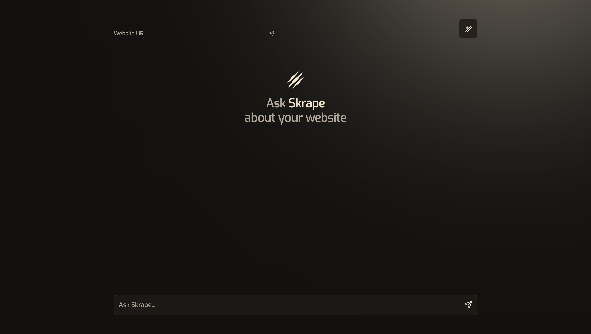
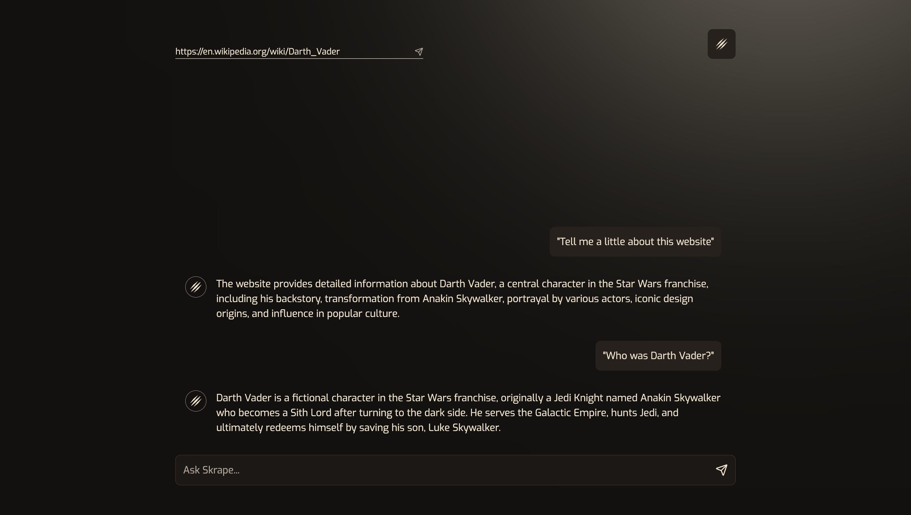

# Skrape

## Table of Contents

- [Description](#description)
- [Installation](#installation)
- [Usage](#usage)
- [License](#license)

## Description

Skrape is a simple web scraper that uses the BeautifulSoup library and OpenAI Api to scrape the contents of a webpage and be able to summaraize and inform the user of the contents of the webpage.




## Installation

1. Clone the repository

```bash
git clone https://github.com/owenkanzler/Skrape
```

2. Install the required packages

```bash
pip install -r requirements.txt
```

3. Create a .env file in the root directory and add your OpenAI API key

```
OPENAI_API_KEY=your-api-key
```

## Usage

To use Skrape run the backend server using the following command:

```bash
python server/server.py
```

Then run the frontend server using the following command:

```bash
cd client && npm start
```

Enter a url in the input field and click the submit button to scrape the contents of the webpage. Ask the bot any questions you have about the webpage and it will respond with the answer.

## License

This project is licensed under the MIT License - see the [LICENSE](LICENSE) file for details.
